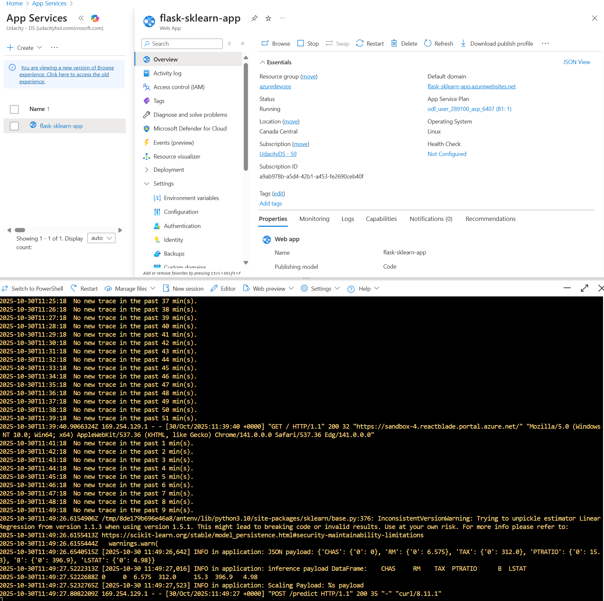
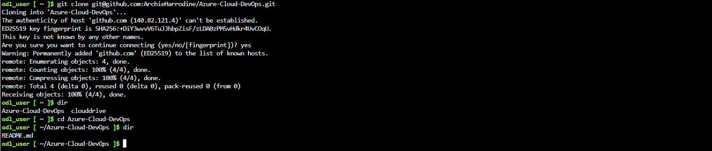
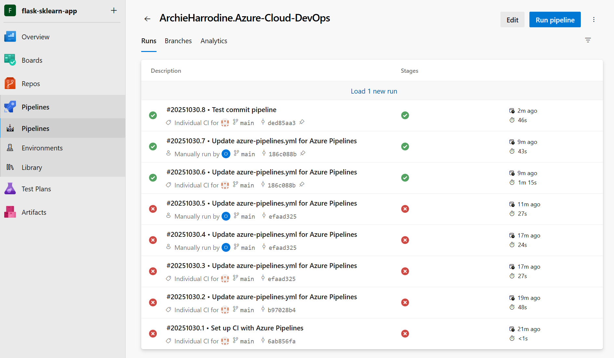
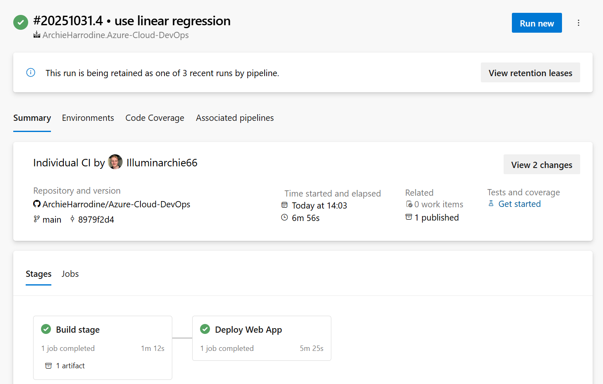
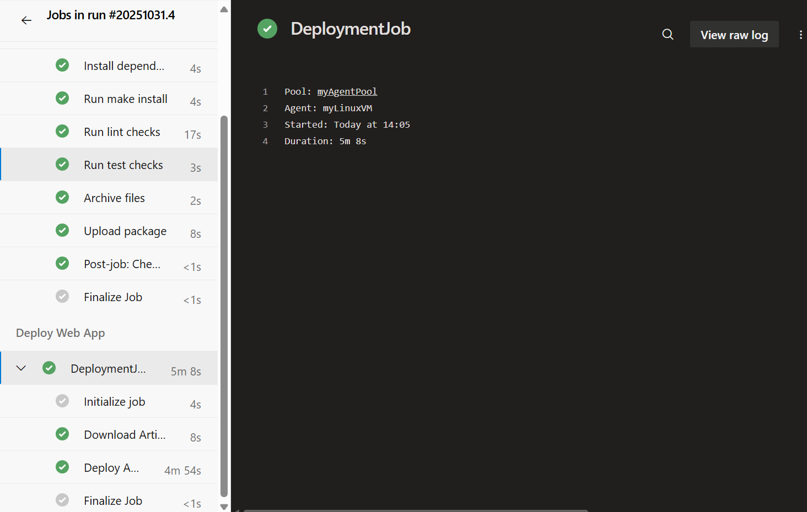
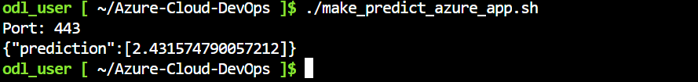
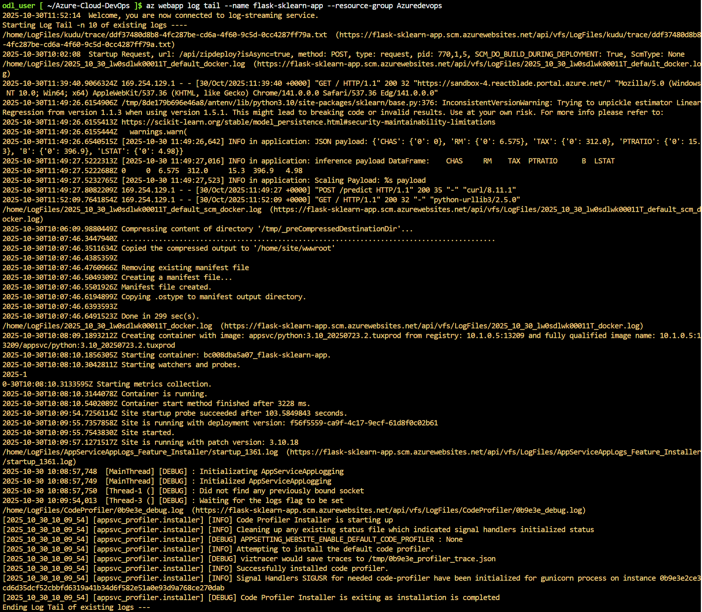

# Overview

[](https://github.com/ArchieHarrodine/Azure-Cloud-DevOps/actions/workflows/pythonapp.yml)

This project is creating a CI/CD pipeline with Azure Cloud pipeline, for a web app endpoint that can be curled for the output to a machine learning sklearn model. This focused on linking it together with GitHub, so that upon pushing to main, then it will check the quality with linting and testing, and if they succeed then it will deploy the new release. This is a good scaffold for a simple flask web application, and can be easily expanded upon and developed, very effectively in a team setting with Agile methodology and DevOps culture.

## Project Plan
This project is very short and done by a single person, so the project plan doesn't make a lot of sense in some places. Trello boards and time driven spreadsheets make the most sense when there are teams that need an effective way to communicate progress, and when the project is large enough in scope that it isn't following a tutorial for each step. 

* [Spreadsheet](https://docs.google.com/spreadsheets/d/1Gg3DPtGbxHriWF4rwVGyFEUSNVV8iF4S_twSMcztPII/edit?usp=sharing) detailing the project plan.
* [Trello Board](https://trello.com/invite/b/6902011b57350ecc305c87a9/ATTI697d669010881e0e20de03d02c6557ce017E5E7C/azure-cloud-with-devops) used for managing tickets in the project.

## Instructions

<TODO:  
* Architectural Diagram (Shows how key parts of the system work)>

This guide outlines the steps to set up SSH access, deploy a Python web application to Azure App Service, and configure Azure DevOps CI/CD pipelines with a self-hosted Linux agent.

### 1. Generate and Add SSH Keys

In Azure Cloud Shell or your local terminal, generate an SSH key pair:
```bash
ssh-keygen -t rsa
```
Press Enter to accept the default options for all prompts. Display your new public key:
```bash
cat ~/.ssh/id_rsa.pub
```
Copy the displayed key and add it to GitHub. Go to GitHub -> Settings -> SSH and GPG Keys -> New SSH Key. Paste the key and save.

### 2. Clone the repoistory
In the Azure Cloud Shell:
```bash
git clone git@github.com:<organisation_name>/<repository_name>.git
```
You can copy the exact link from your repoistory on GitHub.

### 3. Setup Python virtual environment
Next set up the virtual environment and install the requirements. This can be used for some testing locally.
```bash
python -m venv .venv
source .venv/bin/activate
cd <repository_name>
pip install -r requirements.txt
```

### 4. Deploy the Web App to Azure
Deploy the app in the Azure CLI:
```bash
az webapp up \
  --name <app_name> \
  --resource-group <resource_group> \
  --sku B1 \
  --logs \
  --runtime "PYTHON:3.10"
```
This may take a second to build and deploy. You can see it on the portal in App Services.

### 5. Test the Deployed App
To test that the endpoint is working, in another Azure shell terminal, run the prediction script provided in the GitHub:
```bash
chmod +x make_predict_azure_app.sh
./make_predict_azure_app.sh
```
This should return something like:
```bash
Port: 443
{"prediction": [697.206833661433]}
```

### 6. Configure Azure DevOps
* Go to Azure DevOps -> Organisations -> New Organisation `<org_name>`
* Create a new project in the organisation `<project_name>`
* Navigate to Project Settings -> Service Connections -> New Service Connection
* Create the service connection `<service_name>`, and select Azure Resource Manager, grant access to all pipelines and otherwise use default optuons.
* Navigate to User Settings -> Personal Access Tokens -> New Personal Access Token
* Create the personal access token `<pat_name>`, and give it full access. Copy the token securely, as you won't be able to view it again.
* Navigate to Project Settings -> Agent Pools -> Create new Agent Pool
* Create a new Agent Pool `<agent_name>`, selecting the self-hosted option, and grant pipeline permissions.

### 7. Create and Configure a Linux virtual machine
In the Azure Portal create a new virtual machine:
* Resource Group: `<resource_group>`
* VM Name: `<vm_name>` (e.g. `myLinuxVM`)
* Image: Ubuntu Server
* Size: DS1_v2
* Authentication: Password
* Username: `<username>`
* Password: `<password>`
* Inbound port: Allow SSH (22)
In the portal you will see the public IP address `<pub_ip_address>`. After deployment, connect to the VM:
```bash
ssh <username>@<pub_ip_address>
```
This will prompt you to enter the password you setup before.

### 8. Setup docker on the machine
Once ssh-ed into the VM, run the following commands:
```bash
sudo snap install docker
sudo groupadd docker
sudo usermod -aG docker $USER
```

### 9. Install and configure the DevOps agent
In Azure DevOps, go to the Agent Pool -> New Agent -> Linux and copy the download link. Then the VM:
```bash
curl -O <download_link>
mkdir myagent && cd myagent
tar zxvf ../<vsts-agent-linux>
./config.sh
```
For example the download link will be similar to: `https://vstsagentpackage.azureedge.net/agent/4.261.0/vsts-agent-linux-x64-4.261.0.tar.gz`

You will then be prompted with some inputs:
* License agreement: Y
* Server URL: `https://dev.azure.com/<organisation_name>`
* Authentication type: PAT
* Personal access token: `<pat_name>`
* Agent Pool: `<agent_name>`

Then install and start the service:
```bash
sudo ./svc.sh install
sudo ./svc.sh start
```

### 10. Install Python and development tools on the VM
While still in the VM:
```bash
sudo apt-get update
sudo apt install -y software-properties-common python3.10 python3.10-venv python3-pip python3.10-distutils zip pipx
export PATH=$HOME/.local/bin:$PATH
pipx install pylint
```
Verify that your VM agent appears under Project Settings -> Agent Pools -> `<agent_name>`

### 11. Create and run the pipeline
* In Azure DevOps, navigate to Pipelines -> Create Pipeline
* Connect with GtHub, and select the forked repository.
* Choose the existing YAML file and select `azure-pipelines.yml`.
* Run the pipeline.
When prompted for permissions during the deploy stage, click Permit.

### 12. Redeploy and Test
After the pipeline completes, redeploys, and your app is live you can test predictions again:
```bash
./make_predict_azure_app.sh
```
An example JSON input that is in the file:
```json
{
  "CHAS": { "0": 0 },
  "RM": { "0": 120.575 },
  "TAX": { "0": 112.0 },
  "PTRATIO": { "0": 15.3 },
  "B": { "0": 396.9 },
  "LSTAT": { "0": 4.98 }
}
```
Which can be curled with the command:
```bash
curl -d '<json>'\
     -H "Content-Type: application/json" \
     -X POST https://flask-sklearn-app.azurewebsites.net:$PORT/predict 
```
Which will return a JSON friendly prediction output.

### Required screenshots:

* Project running on Azure App Service


* Project cloned into Azure Cloud Shell


* Passing tests that are displayed after running the `make all` command from the `Makefile`


* Successful deploy of the project in Azure Pipelines.  




* Successful prediction from deployed flask app in Azure Cloud Shell  


* Output of streamed log files from deployed application


---

## Enhancements
The following improvements are planned to extend functionality, maintainability, and scalability:

* **Interactive Interface**  
  Introduce a user-friendly interface for interacting with the application and visualizing predictions, that can be used alongside the API.

* **Configurable Model Options**  
  Add optional CLI flags or configuration parameters to allow selection between different machine learning models of linear regression, gradient descent and .

* **Expanded Deployment Infrastructure**  
  - Implement branch-based deployment workflows (e.g., staging, testing, production).  
  - Integrate automated testing and linting across **all** project files, not just `application.py`.  
  - Improve CI/CD pipeline reliability and coverage for extensive testing and validation.

## Demo 

<TODO: Add link Screencast on YouTube>


